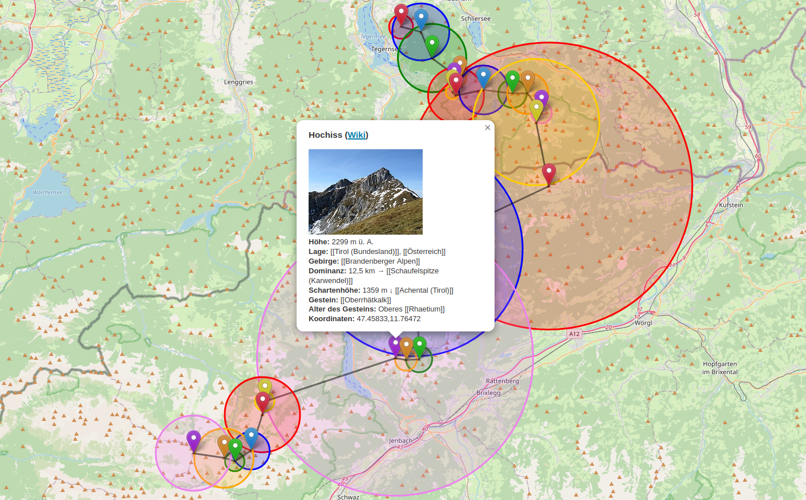
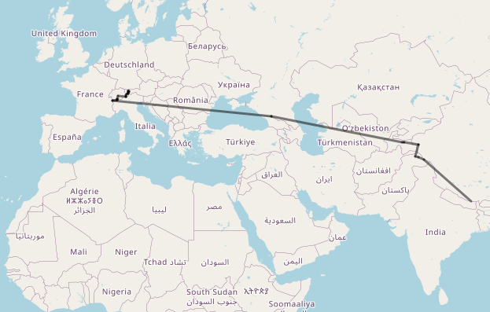

# mountain-isolation
Extraction of the isolation of mountains (=distance to next highest) from Wiki and visualizing it

## background
Born in Bavaria, I went hiking in the Bavarian Alps from an early age.
And every time I reached the top of a mountain, I could see at least one that was higher.
However, within in a certain radius around the peak, there is no higher mountain.
The maximum radius is called the **isolation** of the mountain.

Most articles about mountains in the German Wikipedia contain a reference to the next highest mountain and the isolation in their infobox.
Since Wikipedia has an API, I thought about working with the isolation of mountains.

## goals
The main goal is to use the Wikipedia API to visualize and work with the isolation of mountains.
Currently, the main concern of this project are the following tasks:
- Given a mountain, follow the link to the next highest peak until you reach Mount Everest. Visualize all isolations and the path to Mount Everest on a map.\
*Status: Mostly implemented*
- For as many mountains as possible (i.e., a Wikipedia list of mountains in the Alps), draw their path to Mount Everest.\
*Status: Not implemented yet*

## implementation and design
This project is implemented as a website with a JS frontend and a Python backend.

A search box for articles is implemented.
As the user enters a search term, a Python script sends this data to the Wikipedia OpenSearch API to get articles matching the search term.
This is done through Python to avoid CORS policy issues.
The German Wikipedia is used for now, as the next highest mountain is almost always referred to in the same place.
Support for the English Wikipedia might come later.

To retrieve data from the infobox of a given article, the [wikipedia](https://pypi.org/project/wikipedia/) library is used to first get the HTML of the article. The library [beautifulsoup4](https://pypi.org/project/beautifulsoup4/) is then used to locate and parse the infobox. The library [wptools](https://pypi.org/project/wptools/) is not used here, as its dependencies could not be installed on my limited web server.

Every time a new mountain on the path to Mount Everest is discovered, the path so far is transmitted to the client-side JS using SSE (Server-sent events).

The data is mapped on OpenStreetMap using [leaflet](https://leafletjs.com/).\
Furthermore, a diagram depicting the height of the visited mountains is created using [Highcharts](https://www.highcharts.com/).

## usage
1. Enter a search term in the search box
2. Once the desired article about a mountain appears, click on it (note that it might take more than 1 second for search results to load). Also note that an article name might be ambiguous. In that case, the German Wikipedia pages might add the word "Berg" or the corresponding mountain range in brackets to the title.
3. The isolation and the path to Mount Everest are now shown on the map, mountain by mountain. The path may not get to Mount Everest. In that case, an error message is shown. It is most likely due to a missing Wiki article.
4. Click on the markers to see additional facts from the infoboxes about the mountains. Also, check out the height chart below
5. Hide and show markers and isolation circles by (un)checking the corresponding checkboxes

## installation considerations
- Note that your Web server has to support the Common Gateway Interface (CGI)
- Each Python file must start with a shebang (`#!`) followed by the path to the Python interpreter (here, it is assumed to be `/usr/bin/python3`)
- The Python files have to be executable. To achieve the correct permissions, run `chmod +x /path/to/file.py` on Linux

## glossary
- *Isolation* of a mountain: The minimum distance to a higher mountain
- *Isolation circle*: A circle around a mountain with the radius of its isolation
- *Infobox* of a Wiki article: The box with facts shown on the right-hand side of many articles
- *CORS (Cross-origin resource sharing) policy*: Can restrict accessing other websites from the current page
- *SSE (Server-sent events)*: A way for the server to communicate with the client through events. Here, it is used for updates while the server is running a (possibly) long task
- *CGI (Common Gateway Interface)*: Interface that allows that a backend script in a language like Python can be called from the website
